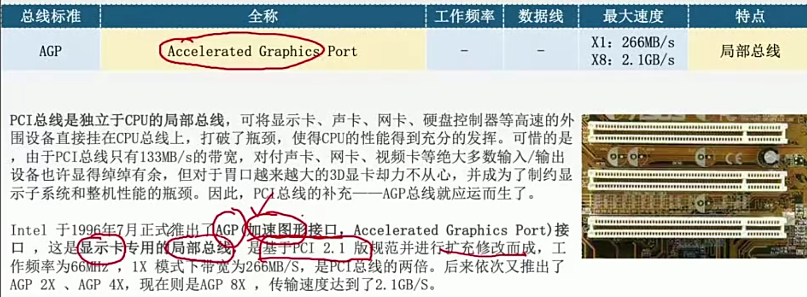
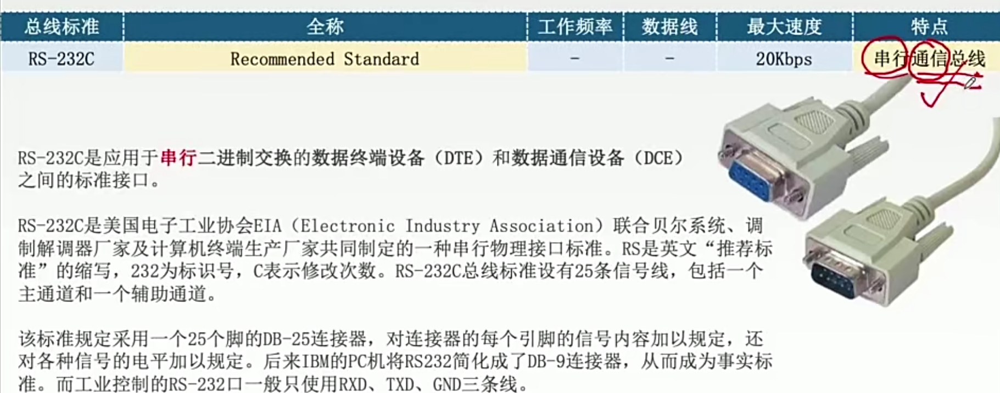
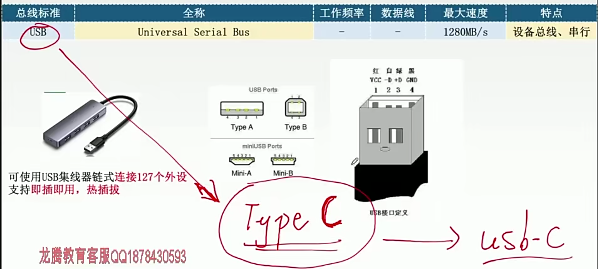
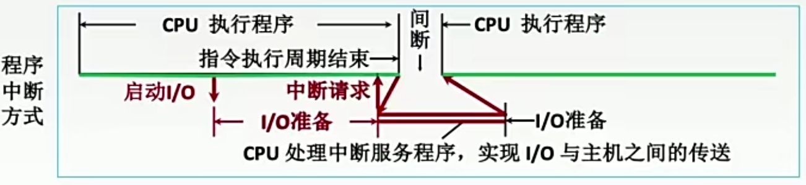
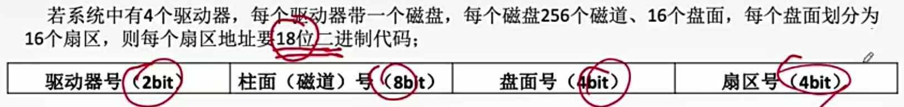
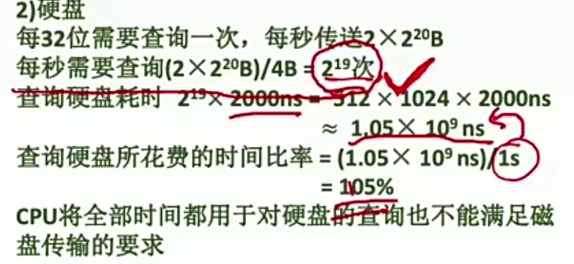
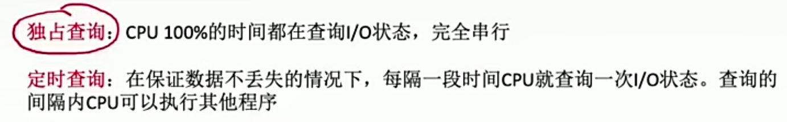
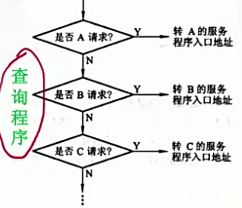

# 第五章：中央处理器

---

---

## 第一节：CPU的功能和结构

---

### 一、CPU的功能

#### (一) 指令控制

完成取指令、分析指令和执行指令的操作，即程序的顺序控制。

#### (二) 操作控制

一条指令的功能往往是由若干操作信号的组合来实现的。CPU管理并产生由内存取出的**每条指令的操作信号**，把各种操作信号送往相应的部件，从而控制这些部件按指令的要求进行动作。

#### (三) 时间控制

对各种操作加以时间上的控制。时间控制要为每条指令按时间顺序提供应有的**控制信号**。

#### (四) 数据加工

对数据进行**算术和逻辑运算**

#### (五) 中断处理

对计算机运行过程中出现的异常情况和特殊请求进行处理

---

### 二、运算器和控制器的功能

---

### 三、运算器的基本结构

#### (一) 算术逻辑单元

主要功能是进行**算术/逻辑运算**

#### (二) 通用寄存器组

用于存放**操作数**和各种**地址信息**

> 操作数包括：**源操作数**、**目的操作数**及**中间结果**

#### (三) 暂存寄存器

用于暂存从**主存**读来的数据

> 这个数据不能存放在通用寄存器中，否则会破坏其原有内容；
>
> 如：两个操作数分别来自主存和R0，最后结果存回R0，那么从主存中取来的操作数直接放入暂存器，就不会破坏运算前R0的内容。

#### (四) 累加寄存器

也属于**通用寄存器**，用于暂时存放ALU运算的结果信息，用于实现加法运算

#### (五) 程序状态字寄存器

保留由算术逻辑运算指令或测试指令的结果而建立的各种**状态信息**（也叫***PSW***）

> 如溢出标志(OP)、符号标志(SF)、零标志(ZF) 、进位标志(CF)等。
>
> PSW中的这些位参与并决定**微操作的形成**。

#### (六) 移位器

对运算结果进行**移位运算**

#### (七) 计数器

控制**乘除运算的操作步数**

---

### 五、控制器的基本结构

#### (一) 程序计数器

用于指出下一条指令在主存中的存放地址。

CPU就是根据PC中的内容去主存中取指令的。

> 因程序中指令（通常）是顺序执行的，所以很多CPU中的PC都有自增功能

#### (二) 指令寄存器

用于保存当前正在执行的那条指令

#### (三) 指令译码器

仅对操作码字段进行译码，向控制器提供特定的操作信号

#### (四) 微操作发生器

根据IR的内容（指令）、PSW的内容（状态信息）及时序信号，产生控制整个计算机系统所需的各种**控制信号**，其结构有组合逻辑型和存储逻辑型两种

#### (五) 时序系统

用于产生各种时序信号，它们都是由统一时钟（CLOCK）分频得到

#### (六) 存储器地址寄存器

用于存放所要访问的主存单元的地址

#### (七) 存储器数据寄存器

用于存放向主存写入的信息或从主存中读出的信息

> 现代CPU内部往往集成了MAR和MDR

---

### 六、数据通路的基本结构

:star:关于运算器相关的数据通路方式：

<u>专用数据通路</u>方式：

- 根据指令执行过程中的数据和地址的流动方向安排连接线路

> 这种方式性能较高，基本不存在数据冲突现象，但结构复杂，硬件量大，不易实现

<u>CPU内部单总线</u>方式：

- 将所有寄存器的输入端和输出端都连接到一条公共的通路上

结构简单，容易实现，但数据传输存在较多冲突的现象，性能较低

---

---

## 第二节：指令执行过程

---

### 一、指令周期的概念

> 一条指令的执行分为不同的阶段

#### (一) 指令周期概述

指令周期：CPU从主存中每取出并执行一条指令所需的全部时间

> 取指令需要**访存**比较慢，指令译码比较快，所以放在一个周期；
>
> 执行指令<u>可能访存也可能不访存</u>

#### (二) 指令周期划分

指令周期常常用若干**机器周期**来表示

> 机器周期又叫**CPU周期**
>
> 机器周期就相当于一个<u>较完整的工作单元</u>

一个机器周期又包含若干个**时钟周期**

> 也称为**节拍**、**T周期**或**CPU时钟周期**，它是CPU操作的**最基本单位**

#### (三) 指令周期举例

>每个指令周期内机器周期数可以不等，每个机器周期内的节拍数也可以不等

#### (四) 指令周期流程

如何确定CPU正处于哪个机器周期？

> 4个工作周期都可以有CPU访存操作，只是访存的目的不同
>
> 取指周期是为了**取指令**，间址周期是为了**取有效地址**，
> 执行周期是为了**取操作数**，中断周期是为了**保存程序断点**。

---

### 二、数据流

> 不同阶段要求依次访问的数据序列

#### (一) 取指周期

1. 当前**指令地址**送至**存储器地址寄存器**，记做: (PC)$\rarr$MAR
2. **CU**发出控制信号，经<u>控制总线</u>传到主存，这里是**读信号**，记做: 1$\rarr$R
3. 将**MAR**所指主存中的内容经<u>数据总线</u>送入**MDR**，记做：M(MAR)$\rarr$MDR
4. 将**MDR**中的内容(此时是**指令**)送入**IR**，记做: (MDR)$\rarr$IR
5. **CU**发出控制信号，形成下一条指令地址，记做: (PC)+1→PC

#### (二) 间址周期

> 1. 将指令的地址码送入MAR，记做: Ad(IR)$\rarr$MAR或Ad(MDR)$\rarr$MAR
> 2. CU发出控制信号，启动主存做读操作，记做: 1$\rarr$R
> 3. 将MAR所指主存中的内容经数据总线送入MDR，记做: M(MAR)$\rarr$MDR
> 4. 将有效地址送至**指令的地址码字段**，记做: (MDR)$\rarr$Ad(IR)

#### (三) 执行周期

执行周期的任务是根据IR中的指令字的操作码和操作数通过ALU操作产生执行结果。

不同指令的执行周期操作不同，因此没有统一的数据流向。

> 这里先不详细讨论

#### (四) 中断周期

中断：暂停当前任务去完成其他任务。

为了能够恢复当前任务，需要保存断点。

> 一般使用堆栈来**保存断点**，这里用SP表示栈顶地址，
> 假设SP指向栈顶元素，进栈操作是<u>先修改指针，后存入数据</u>
>
> 

1. **CU**控制将**SP**减1，修改后的地址送入MAR，记做: (SP) - 1$\rarr$SP，(SP)$\rarr$MAR
本质上是将**断点**存入某个存储单元，假设其地址为a，故可记做: a$\rarr$MAR
2. **CU**发出控制信号，启动主存做**写**操作，记做: 1$\rarr$W
3. 将断点(**PC**内容)送入MDR，记做: (PC) $\rarr$ MDR
4. **CU**控制将中断服务程序的入口地址（由向量地址形成部件产生）送入PC，记做：向量地址$\rarr$PC

---

### 三、指令执行方案

> 如何安排多条指令的执行

一个指令周期通常要包括几个时间段（执行步骤），每个步骤完成指令的一部分功能，几个依次执行的步骤完成这条指令的全部功能。

#### (一) 单指令周期

对所有指令都选用<u>相同的执行时间</u>来完成

特点：

- 指令间**串行**执行

优点：

- 控制电路方便

缺点：

- 快指令可能因慢指令而延长

#### (二) 多指令周期

对不同类型的指令选用不同的执行步骤来完成。

特点：

- 指令之间串行执行
- 可选用不同个数的时钟周期来完成不同指令的执行过程。

#### (三) 流水线方案

在每一个**时钟周期**启动一条指令，尽量让多条指令同时运行，但各自处在不同的执行步骤中。

指令之间**并行**执行。

---

---

## 第三节：数据通路的功能和基本结构

---

### 一、数据通路结构示意图

> 如何设置部件之间的连接路径

> 绿色的in和深蓝色的out指的是控制总线上发出的信号

> CPU内部**单总线**同一时刻只允许两个部件进行数据交换，独占了总线，
>
> **多总线**就可以解决这个问题，
>
> 当然也有专用数据通路

---

### 二、CPU内部单总线数据传输详解

> 描述指令执行过程中信号和数据在这些路径上的传输

> 单总线指的是**CPU内部**单总线，CPU内部连接各<u>寄存器</u>及<u>运算部件</u>之间的总线
>
> > 系统总线是指同一台计算机系统的**各部件**，如CPU、内存、通道和各类I/O接口间互相连接的总线
>
> 数据流通可分为三类：
>
> - 寄存器之间（CPU内部总线）
> - 寄存器与主存（系统总线）
> - 寄存器与ALU（CPU内部总线）
>
> > 内部总线也可以用来传输控制信号

- 寄存器之间的数据传送

  

  比如把PC内容送至MAR，实现传送操作的流程及控制信号为：

  | 数据流         | 信号与注释               |
  | -------------- | ------------------------ |
  | (PC)$\rarr$Bus | PCout有效，PC内容送总线  |
  | Bus$\rarr$MAR  | MARin有效，总线内容送MAR |

  > 也可写为：(PC)$\rarr$Bus$\rarr$MAR
  > 也有的教材写为：PC$\rarr$Bus$\rarr$MAR
  > 重要的是描述清楚**数据流向**

- 主存与CPU之间的数据传送

  

  > 注意，**MAR**、**MDR**与**主存**之间的数据通路也是由**控制信号**控制的

  比如CPU从主存读取指令，实现传送操作的流程及控制信号为：

  | 数据流                   | 信号与注释                               |
  | ------------------------ | ---------------------------------------- |
  | (PC)$\rarr$Bus$\rarr$MAR | PCout和MARin有效，现行指令地址$\rarr$MAR |
  | 1$\rarr$R                | CU发读命令(通过控制总线发出，图中未画出) |
  | MEM(MAR)$\rarr$MDR       | MDRinE有效                               |
  | MDR$\rarr$Bus$\rarr$IR   | MDRout和IRin有效，现行指令$\rarr$IR      |

- 执行算术或逻辑运算
  

  比如一条加法指令，微操作序列及控制信号为：

  | 数据流                          | 信号及注释                                                   |
  | ------------------------------- | ------------------------------------------------------------ |
  | Ad(IR)$\rarr$Bus$\rarr$MAR      | MDRout和MARin有效 或 AdIRout和MARin有效                      |
  | 1$\rarr$R                       | CU发读命令(通过控制总线发出，图中未画出)                     |
  | MEM(MAR)$\rarr$数据线$\rarr$MDR | MDRinE有效                                                   |
  | MDR$\rarr$Bus$\rarr$Y           | MDRout和Yin有效，操作数$\rarr$Y(暂存)                        |
  | (ACC)+(Y)$\rarr$Z               | ACCout和ALUin有效，CU向ALU发送加命令， 结果存放在暂存寄存器Z中 |
  | Z$\rarr$ACC                     | Zout和ACCin有效，结果$\rarr$ACC                              |

  > 暂存寄存器Y、Z与ALU之间有专用数据通路；如果CPU内部有双总线也可以不用暂存

> 例题：
>
> 
>
> 
>
> 1. 分析指令功能和指令周期
>
>    - 功能：((R~0~))+(R~1~)$\rarr$(R~0~)
>
>      > 这里，寄存器标识符可以理解成<u>指针</u>，指令后面可以直接写<u>指针</u>，
>      > 但在写表达式时，在**左侧**就需要额外加上一层**括号**了
>      >
>      > > 箭头**右侧**标识符会省略单层括号，也就是代表<u>指针</u>
>      > >
>      > > 但如果有括号了，就像上式那样，一般代表<u>寄存器内的地址对应的地址单元</u>
>
>    - 指令周期：取指、间址、执行
>
> 2. 写出各阶段的指令流程
>
>    - 取指：（公共操作）
>
>      | 时序 |          微操作           |     有效控制信号     |
>      | :--: | :-----------------------: | :------------------: |
>      |  1   |         (PC)→MAR          |     PCout, MARin     |
>      |  2   | M(MAR)→MDR (PC)+1→PC | MemR, MARout, MDRinE |
>      |  3   |         (MDR)→IR          |     MDRout, IRin     |
>      |  4   |         指令译码          |          -           |
>
>    - （寄存器间接寻址）间址：完成取数操作，被加数在主存中，加数已经放在寄存器R1中
>
>      | 时序 |   微操作   |     有效控制信号     |
>      | :--: | :--------: | :------------------: |
>      |  1   | (R~0~)→MAR |    R~0~out, MARin    |
>      |  2   | M(MAR)→MDR | MemR, MARout, MDRinE |
>      |  3   |  (MDR)→Y   |     MDRout, Yin      |
>
>    - 执行周期
>
>      | 时序 |    微操作    |             有效控制信号             |
>      | :--: | :----------: | :----------------------------------: |
>      |  1   | (R~1~)+(Y)→Z | R~1~out, ALUin, CU向ALU发ADD控制信号 |
>      |  2   |   (Z)→MDR    |             Zout, MDRin              |
>      |  3   | (MDR)→M(MAR) |         MemW, MDRout, MARout         |

---

### 三、专用通路结构

#### (一) 概览

#### (二) 通路运作方式

- 取指周期：

  

  | 微操作           | 有效控制信号       |
  | ---------------- | ------------------ |
  | (PC)$\rarr$MAR   | C~0~有效           |
  | (MAR)$\rarr$主存 | C~1~有效           |
  | 1$\rarr$R        | CU向主存发送读命令 |
  | M(MAR)$\rarr$MDR | C~2~有效           |
  | (MDR)$\rarr$IR   | C~3~有效           |
  | (PC)+1$\rarr$PC  |                    |
  | Op(IR)$\rarr$CU  | C~4~有效           |

- 例题：

  

  

  > 省略多路选择器或三态门，
  > 意思就是连接器件的信号线一般情况下同一时刻只能有一个有效

  - (1) 

    - d能自动“+1”，是PC
    - PC的内容送给了c，则c是MAR
    - b能直接给**微操作发生器**发送信号，是IR
    - a与主存直接相连，且是双向的，所以是MDR

  - (2)

    1. (PC)$\rarr$MAR

    2. M(MAR)$\rarr$MDR

       > 省略了MAR到主存，控制单元给主存读信号的过程

    3. (MDR)$\rarr$IR

    4. (PC)+1$\rarr$PC

       > **这一步别忘了**

    5. Op(IR)$\rarr$微操作发生器

  - (3)

    > 假设数据地址已经存放在了MAR中

    - 从主存中读数据到ACC

      1. M(MAR)$\rarr$MDR

      2. (MDR)$\rarr$ALU$\rarr$ACC

         > ALU不是寄存器，只是一个组合逻辑部件，在本次数据流通中是作为中转

    - ACC向主存中写数据
  
      1. (ACC)$\rarr$MDR
      2. (MDR)$\rarr$M(MAR)

  - (4)、(5)、(6)

    1. X$\rarr$MAR

       > X就是一个值，这里也可以使用Ad(IR)$\rarr$MAR

    2. M(MAR)$\rarr$MDR

    3. (MDR)$\rarr$ALU$\rarr$ACC

    4. Y$\rarr$MAR

    5. M(MAR)$\rarr$MDR

    6. (MDR)$\rarr$ALU, (ACC)$\rarr$ALU

    7. ALU$\rarr$ACC

       > 其实ALU下面应该有个暂存寄存器，信号稳定后在传输给ACC

    8. Z$\rarr$MAR

    9. (ACC)$\rarr$MDR
  
    10. (MDR)$\rarr$M(MAR)

---

---

## 第四节：:star:控制器的功能和工作原理

---

### 一、控制器设计思路

> 控制器如何指挥整个系统的工作

#### (一) 指令周期与相关寄存器

- 每个周期对应一个寄存器

#### (二) 微命令与微操作

CU发送**微命令**，就可以完成对应的**微操作**

- 微命令一般是指，什么**信号**有效

  > 如PC~out~、MAR~in~有效

- 微操作一般是指，数据的流向是怎样的

  > 如(PC)$\rarr$MAR

CU在一个**时钟节拍**下是可以发出**多个微命令**的

> 
>
> - 一个节拍内可以**并行**完成多个相容的微操作
>
> - 同一个微操作可能在不同指令的不同阶段被使用
>
> - 不同指令的执行周期所需必要节拍数各不相同，
>   为了简化设计，可以选择**定长指令周期**，以可能出现的最大节拍数为准
>
>   > 通常以**访存**所需节拍数为参考（因为访存比较慢）
>
>   > 若实际所需节拍数较少，可将微操作安排在机器周期末尾几个节拍上进行

#### (三) 设计控制器的核心思想

根据：

- 指令操作码

- 目前的机器周期

- 节拍信号

- 机器状态条件

  > 如PSW

即可确定现在这个节拍下应该发出哪些”微命令“

---

### 二、硬布线控制器

> 设计的核心思想就是上面记的

#### (一) 各信息的作用

指令操作码：

目前的机器周期：

节拍信号：

> 定长指令周期的话，节拍信号就都是m+1个

机器状态条件/标志：

> 总体：
>
> 

#### (二) 逻辑表达式的确定

>接下来要解决的就比如，什么时候发出C~1~信号呢？
>
>转化问题：C~1~的**逻辑表达式**是什么
>
>所有指令的取指周期，T~0~节拍下一定要完成(PC)→MAR，则可知C~1~=FE · T~0~
>
>
>
>

> 接下来再用更复杂的$M(MAR)\rarr MDR$举例

先给出$M(MAR)\rarr MDR$的逻辑表达式：
$$
FE\cdot T_1+IND\cdot T_1(ADD+STA+LDA+JMP+BAN)+EX\cdot T_1(ADD+LDA)
$$

再分析几个项：

- $FE\cdot T_1$

  

  > 仍然是在**取指**阶段，但是在第二个**节拍**

- $EX\cdot T_1(ADD+LDA)$

  

  > 在**执行**阶段，在第T~1~个**节拍**，**操作码**(操作码译码器)是加法或取数

:star:总结出**==设计步骤==**：

1. 分析每个阶段对应的微操作序列

   > 取指、间址、执行、中断；
   >
   > 确定哪些指令在什么阶段、在什么条件下会使用到某个微操作；
   >
   > 执行阶段较复杂，其他阶段较固定，所以CPU支持的指令越多，这个步骤越麻烦

2. 选择CPU的控制方式

   > 采用<u>定长</u>机器周期还是<u>不定长</u>机器周期？每个机器周期安排<u>几个节拍</u>？

3. 安排微操作时序

   > 在某个阶段中，每个节拍都干什么；
   >
   > 别忘了同一个节拍下是可以控制多个微操作的

4. 电路设计

   > 确定每个微命令对应的逻辑表达式，并用电路实现

#### (三) 设计举例

1. **<u>分析每个阶段对应的微操作序列</u>**

   - 取指周期(所有指令都一样)

   

   - 间址周期(所有指令都一样)

   

   - 执行周期(各不相同)

   > 下面举出若干个例子

   

   

   

   

   >A~0~代表符号位，绿色的，表示这是一个**机器状态条件**

   >罗列出所有指令在各个阶段的微操作序列，就可以知道在什么情况下需要使用这个微操作

   > 省略对中断周期的分析

2. **<u>选择CPU的控制方式</u>**

   - 假设采用定长机器周期，一个机器周期内安排3个节拍

3. **<u>安排微操作时序</u>**

   > 原则：
   >
   > - 微操作的**先后顺序**不得随意更改
   >
   > - **被控对象不同**的微操作尽量安排在**一个节拍**内完成
   >
   >   > 比如(PC)→MAR的被控对象是寄存器，1→R的被控对象是主存，不同，就可以安排在同一个节拍内完成
   >
   > - 占用时间较短的微操作尽量安排在一个节拍内完成，并允许有先后顺序
   >
   >   > 在CPU内部的寄存器之间的数据流通很快，可以快速进行相关微操作

   - 取指周期

     

     > 1和2被控对象不同，3和6互相不影响，4和5虽然有**前后依赖**关系，但执行时间都较**短**
     >
     > > 为啥不能把3和4也合并？因为3是从主存中取数据，用时较**长**，必须安排一个时钟周期

   - 间址周期

     

     > 3和4不能边起来，因为涉及到访存

   - 执行周期

     - 非访存指令

       - CLA：ACC清零

         

         >只需一条微指令，安排在最后一个节拍

       - COM：ACC取反

         > 每一条指令在执行周期内做的微操作各不相同，但所有的微操作都要安排好

       - 所有的：

         

     - 访存指令

       

       > 为什么要区分访存和非访存，因为访存的可能还涉及到**间址周期**

     - 转移指令

       

4. **<u>电路设计</u>**

   1. 列出操作时间表

      > 列出在取指、间址、执行、中断**周期**，T~0~、T~1~、T~2~**节拍**内有可能用到的所有**微操作**

   2. 写出**微操作命令**的最简**表达式**

   3. 画出逻辑图

   > 下面是这个例子中电路设计的具体步骤：
   >
   > 1. 操作时间表
   >
   >    - FE(取指)
   >
   >      
   >
   >      > 前6条是共有的。后两条是跟**间址特征**有关的，非访存和访存就有所不同了；
   >      > 当然访存指令包含的地址码也可能不需要间址，也可以直接进入**执行阶段**
   >
   >    - IND(间址)
   >
   >      
   >
   >      > 非访存指令肯定是用不到的，所以都空着；
   >      > 间址有可能是**多级**的，所以还要看IND这个状态条件 
   >
   >    - EX(执行)
   >
   >      
   >
   >      > 把**所有指令**在**同一个节拍**出现的**微操作**都放到对应节拍的那一行中
   >
   > 2. 写出微操作命令的最简表达式
   >
   >    
   >
   >    
   >
   >    > 在时间表中，找到一个**微操作**的<u>所有出现位置</u>

#### (四) 硬布线控制器的特点

- <u>指令越多</u>，设计和实现就越复杂，因此一般用于RISC

  > RISC：精简指令集系统

- 如果扩充一条新的指令，则控制器的设计可能需要很大改动，因此**扩充指令较困难**

- 使用纯硬件实现控制，**执行速度很快**，微操作控制信号由组合逻辑电路即时产生

---

### 三、微程序控制器

#### (一) 微程序设计思路

- 程序与指令

  - 程序由**指令序列**组成
  - 指令是对**程序执行步骤**的描述

- 微指令与微程序

  - 微指令是对**指令执行步骤**的描述

    >微命令与微操作一一对应，<u>微指令可能包含多个微操作</u>

  - 微程序由**微指令序列**组成

    > 一条指令对应一个微程序；所以可以说，指令是对微指令功能的“封装”

> 采用“存储程序”的思想，CPU出厂前将所有指令的“微程序”存入“控制器存储器”
>
> > 控制器内部的特殊的存储器
>
> **微指令**的基本格式：
>
> 
>
> > **操作控制**：微指令对应的<u>微操作</u>是什么
> >
> > **顺序控制**：指明下一条微指令的<u>地址</u>

#### (二) 微程序控制器基本结构

- 控制器存储器（CM）

  

  > 存放各指令对应的微程序，由ROM构成

- CMAR、地址译码器

  - CMAR别名$\mu PC$，是**微地址寄存器**，接收微地址形成部件送来的微地址，为在CM中读取微指令作准备
  - 地址译码器：将地址码转化为存储单元控制信号 

- CMDR

  - 别名$\mu IR$
  - 用于存放从CM中取出的**微指令**
  - 它的位数同微指令字长相等

- 微地址形成部件

  - 产生**初始微地址**和**后继微地址**，以保证微指令的连续执行

- 顺序逻辑

  - 控制微指令的具体执行顺序

  > 比如会根据**寻址特征**判断是否要**间址**，从而判断是否跳过间址周期

> 有些机器周期的微程序段是可以多条指令共享的，比如取指、间址、中断
>
> 

#### (三) 微程序执行

举例：

> Tips：
>
> - 如果某指令系统中有n条机器指令，则CM中**微程序段**的个数至少是n+1个
>
>   > 取指和执行必须有
>
>   > <u>一条指令对应一个微程序</u>，说法是对的；
>   >
>   > 但取指、间址、中断、执行确实可以再划分成一个微程序段

#### (四) 微指令的设计

##### 1、微指令的格式

> 相容型微命令：可以并行完成的微命令
>
> 互斥型微命令：不允许并行完成的微命令

- 水平型微指令

  

  > 为什么比较长？

  

  - 一条微指令能定义多个**可并行的微命令**
  - 优点：微程序短，执行速度快
  - 缺点：微指令长，编写微程序比较麻烦

- 垂直型微指令

  

  

  - 一条微指令只能定义**一个微命令**，由微操作码字段规定具体功能
  - 优点：微指令短、简单、规整，便于编写微程序
  - 缺点：微程序长，执行速度慢，工作效率低

- 混合型微指令

  - 在垂直型的基础上增加一些不太复杂的并行操作。
  - 微指令较短，仍便于编写；微程序也不长，执行速度加快。

##### 2、操作控制字段设计

> 采用水平型微指令

> 微指令的**编码方式**又称为微指令的**控制方式**，它是指如何对微指令的控制字段进行编码，以形成控制信号。编码的目标是在保证速度的情况下，尽量缩短微指令字长。

- 直接编码（直接控制）方式

  

  - 在微指令的操作控制字段中，**每一位代表一个微操作命令**
    某位为“1”表示该控制信号有效

  - 优点：简单、直观，执行速度**快**，操作**并行**性好。

  - 缺点：微**指令字长**过长，n个微命令就要求微指令的操作字段有n位，造成**控存容量**极大。

    > 怎么变短呢？下面这种方式就解决了这个问题

- 字段直接编码方式

  

  - 将微指令的控制字段分成若干“段”，每段经译码后发出控制信号

    > 分段原则：
    >
    > - **互斥性**微命令分在**同一段**内，**相容性**微命令分在**不同段内**。
    >
    > - 每个小段中包含的**信息位不能太多**，否则将增加译码线路的复杂性和译码时间。
    >
    > - 一般每个小段还要留出一个状态，表示本字段**不发出任何微命令**。
    >
    >   > 因此，当某字段的长度为3位时，最多只能表示7个互斥的微命令，
    >   > 通常用000表示不操作。

  - 优点：可以缩短微命令字长

  - 缺点：要通过**译码电路**后再发出微命令，因此比直接编码方式慢

  > 例题：
  >
  > 

- 字段间接编码方式

  

  - 一个字段的某些微命令需由另一个字段中的某些微命令来解释，

    > 由于不是靠字段直接译码发出的微命令，故称为字段间接编码，又称隐式编码。

  - 优点:可进一步缩短微指令字长。

  - 缺点:削弱了微指令的并行控制能力，故通常作为字段直接编码方式的一种辅助手段。

##### 3、微指令的地址形成方式

- 微指令的**下地址字段**指出

  - 微指令格式中设置一个下地址字段，由微指令的下地址字段直接指出后继微指令的地址

    > 这种方式又称为==断定方式==

- 根据机器指令的**操作码**形成

  - 当机器指令取至指令寄存器后，微指令的地址由操作码经微地址形成部件形成。

- **增量==计数器法==**

  - (CMAR) + 1 → CMAR

- 分支转移

  - 转移方式：指明判别条件
  - 转移地址：指明转移成功后的去向

  

- 通过测试网络

  

- 由硬件产生微程序入口地址

  - 第一条微指令地址：由专门硬件产生

    >用专门的硬件记录取指周期微程序首地址

  - 中断周期：由硬件产生中断周期微程序首地址

    > 用专门的硬件记录

> 例题：
>
> 

#### (五) 微程序控制单元的设计

##### 1、设计步骤

1. 分析每个阶段的**微操作序列**

2. 写出对应**机器指令的微操作**命令及节拍安排

   1. 写出每个周期所需要的微操作（参考硬布线）

   2. 补充微程序控制器特有的微操作

      1. 取指周期

         - Ad(CMDR)→CMAR

           > 每条微指令结束之后都要进行

         - OP(IR)→微地址形成部件→CMAR

           > 取指周期的最后一条微指令完成后，
           > 要根据指令操作码确定其执行周期的微程序首地址

      2. 执行周期

         - Ad(CMDR)→CMAR

           >每条微指令结束之后都要进行

3. 确定**微指令格式**

   - 根据微操作个数决定采用何种编码方式，以确定微指令的操作控制字段的位数。
   - 根据CM中存储的微指令总数，确定微指令的顺序控制字段的位数。
   - 最后按操作控制字段位数和顺序控制字段位数就可确定微指令字长。

4. 编写**微指令码点**

   - 根据操作控制字段每一位代表的微操作命令，编写每一条微指令的码点。

##### 2、举例

1. 分析每个阶段的**微操作序列**

2. 写出对应**机器指令的微操作**命令及节拍安排

   - 取指阶段：

     

     > 把**读取微指令**的操作并入
     >
     > 

##### 3、微程序设计分类

- 静态微程序设计和动态微程序设计
  - 静态：微程序无需改变， 采用ROM
  - 动态：通过改变**微指令**和**微程序**改变机器指令。有利于仿真，采用EPROM
- 毫微程序设计
  - 亳微程序设计：用**亳微程序**解释**微程序**

#### (六) 硬布线与微程序比较

----

---

## 第五节：指令流水线

---

> 为什么引入流水线结构？
>
> 有哪些结构？
>
> 会产生什么问题

### 一、基本概念和性能指标

#### (一) 指令流水的定义

##### 1、指令执行方式

- 顺序执行方式

  

- 一次重叠执行方式

  

- 二次重叠执行方式

  

  > 常常会将指令的执行过程划分成4或5个阶段

##### 2、流水线的表示方法

- 指令执行过程图

  

- 时空图

  

#### (二) 流水线的性能指标

##### 1、吞吐率

- 吞吐率是指在**单位时间**内流水线所完成的**任务**数量，或是输出结果的数量

> 计算举例：
>
> 
>
> 认为$\Delta t$是一个时钟周期，因为这里考虑的是最理想的状态，首先第一条指令执行完后，接下来每过一个$\Delta t$就会有一条指令执行完

> 装入时间和排空时间：
>
> 

##### 2、加速比

- 完成同样一批任务， 不使用流水线所用的时间与使用流水线所用的时间之比

> 计算举例：
>
> 

##### 3、效率

- 流水线设备的利用率称为流水线的效率

  >在时空图上，流水线的效率定义为：
  >
  >完成n个任务占用的时空区有效面积
  >
  >与
  >n个任务所用的时间与k个流水段所围成的时空区总面积
  >
  >之比

> 计算举例：
>
> 
>
> 
>
> 

---

### 二、影响因素和分类

#### (一) 五段式指令流水线

> 精简指令集MIPS架构提出的

> 规定每条指令必须经过**五个阶段**
>
> > 尽管有的阶段什么也不做
>
> 规定每个阶段**耗时都和最长的保持一致**
>
> > 为此，需要添加**暂存寄存器**：（也叫锁存器）
> >
> > 
> >
> > <u>作用：保存本流水段执行结果，供给下一流水段在一定时间后使用</u>

各阶段解释：

- Instruction Fetch

  - 大多数情况下从***Instruction Cache***中就可以取到需要的指令，
    有时也是会访问**主存**的

- Instruction Decode

  - 指令译码

  - ==从**通用寄存器**中取出**操作数**，放到<u>锁存器</u>中==

    > 所需操作数如果在主存中，也会提前放入至**通用寄存器**内

- Execute

  - 执行
  - 运算结果有可能写回主存/Data Cache，也可能不需要，也可能直接写回通用寄存器

- Memory

  - 大多数情况下通过***Data Cache***中就可以达到<u>访问**主存**</u>的效果

    > Instruction Cache和Data Cache是两个独立的模块，因而对应的两个阶段也可以**并行**

    > 如果Cache没有命中，就会出现<u>断流</u>的情况，较复杂，这里不讨论

- Write Back

  - 将数据写回通用寄存器中

    > ID阶段可能会**读**通用寄存器，WB阶段可能会**写**通用寄存器，这就有可能引发冲突

#### (二) 影响流水线的因素

##### 1、结构相关（资源冲突）

- 概念：由于**多条指令**在同一时刻争用**同一资源**而形成的冲突称为结构相关

- 冲突的表现：

  

  > 这里是假设**指令**和**数据**都需要访问**主存**

- 解决办法：

  - 后一相关资源暂停一周期

  - **资源重复配置**：**数据**存储器+**指令**存储器

    > 使用数据和指令的 *Cache* 就是一种资源重复配置

##### 2、数据相关（数据冲突）

- 概念：数据相关指在一个程序中，存在必须等前一条指令执行完才能执行后一条指令的情况，
  则这两条指令即为**数据相关**。

- 冲突表现：

  

- 解决办法：

  - 把遇到数据相关的指令及其后续指令都暂停一至几个时钟周期，直到数据相关问题消失后再继续执行。

    > 可分为**硬件阻塞**(stall)和**软件插入**“NOP”两种方法。
    >
    > stall：
    >
    > 
    >
    > NOP：
    >
    > 
    >
    > > 具体要插入几条，是**编译器**完成的

  - 数据旁路技术/转发机制

    

    > 不再通过寄存器了，直接根据指令需求传递数据

  - 编译优化：通过编译器调整**指令顺序**来解决数据相关

    > 相关于把NOP换成有用的操作

##### 3、控制相关（控制冲突）

- 定义：当流水线遇到转移指令和其他**改变PC值**的指令而造成**断流**时，会引起控制相关。

- 冲突表现：

  

  > 我们主要探讨的是由**转移指令**导致的控制冲突

- 解决办法

  - **转移指令分支预测**。简单预测(永远猜ture或false)、动态预测(根据历史情况动态调整)
  - **预取**转移成功和不成功两个控制流方向上的目标指令
  - 加快和提前形成条件码
  - 提高转移方向的猜准率

#### (三) 流水线的分类

##### 1、流水线使用的级别不同

- 部件功能流水线

  - 部件功能级流水就是将复杂的**算术逻辑运算**组成**流水线**工作方式。

    > 例如，可将浮点加法操作分成求阶差、对阶、尾数相加以及结果规格化等4个子过程。

- 处理机级流水线

  - 处理机级流水是把一条**指令解释过程**分成多个**子过程**

    > 如前面提到的取指、译码、执行、访存及写回5个子过程。
    >
    > **指令流水线**就属于处理机级流水线

- 处理机间流水线

  - 处理机间流水是一种宏流水，其中每一个处理机完成某一专门任务，各个处理机所得到的结果需存放在与下一个处理机所共享的存储器中。

##### 2、流水线可以完成的功能

- 单功能流水线

  - 只能实现一种固定的**专门功能**的流水线

- 多功能流水线

  - 通过各段间的<u>不同连接方式</u>可以同时或不同时地实现**多种功能**的流水线

    >**指令流水线**就属于多功能流水线

##### 3、同一时间内各段之间的连接方式

- 静态流水线

  - 在**同一时间**内，流水线的各段只能按**同一种功能**的连接方式工作

    > 比如进行浮点数加法的时候就不能进行乘法类操作

- 动态流水线

  - 动态流水线指在同一时间内，
    当某些段正在实现某种运算时，另一些段却正在进行另一种运算。 

    > 这样对提高流水线的效率很有好处，但会使流水线控制变得很复杂。

##### 4、各个功能段之间是否有反馈信号

- 线性流水线

  - 从输入到输出，每个功能段只允许经过一次，不存在反馈电路

- 非线性流水线

  - 存在**反馈电路**，从输入到输出过程中，某些功能段将<u>数次通过</u>流水线，这种流水线适合进行线性递归的运算

    > 比如解决数据冲突时：
    >
    > 

    > 数次通过：比如用加法代替乘法时就可能数次通过

#### (四) 流水线的多发技术

##### 1、超标量技术

> 有点像**空分复用技术**

- 每个时钟周期内可**并发多条独立指令**
- 要配置**多个功能部件**
- 不能调整指令的**执行顺序**
- 通过**编译优化技术**，把可并行执行的指令搭配起来

##### 2、超流水技术

> 有点像**时分复用技术**

- 在**一个时钟周期**内再分段
- 在一个时钟周期内**一个功能部件使用多次**
- 不能调整指令的**执行顺序**
- 靠编译程序解决优化问题

##### 3、超长指令字

- 由**编译程序**挖掘出指令间潜在的**并行性**，将多条能**并行操作**的指令组合成一条具有**多个操作码**字段的<u>超长指令字</u>
- 采用**多个处理部件**

---

### 三、五段式指令流水线

> 承接上一点中对五段式指令流水线的简述

#### (一) 运算类指令的执行过程

> 运算类指令举例：
>
> 

1. IF：根据PC从指令Cache中取指令至IF段的**锁存器**

2. ID：取出**操作数**至ID段**锁存器**

3. EX：运算，将结果存入EX段**锁存器**

4. M：空段

   > 对于精简指令集来说运算指令的操作数一定来自于寄存器，结果一定**存回寄存器**，不会直接访问主存（也不会去访问Data Cache）

5. WB：将运算结果写回指定寄存器

   > 
   >
   > 数据直接这样流动到寄存器中

#### (二) LOAD指令的执行过程

> 指令举例：
>
> 

1. IF：根据PC从指令Cache中取指令至IF段的**锁存器**

2. ID：将**基址**寄存器的值放到**锁存器A**，将偏移量的值放到**imm**

3. EX：运算，得到**有效地址**EA

4. M：从**数据Cache**中取数并放入锁存器

   > 在RISC中只有“取数LOAD”和“存数STORE“指令才会直接访问主存
   >
   > > 其他的要么在寄存器中，要么是立即数

5. WB：将取出的数写回**寄存器**

#### (三) STORE指令的执行过程

> 指令举例：
>
> 

1. IF：根据PC从指令Cache中取指令至IF段的**锁存器**

2. ID：将**基址**寄存器的值放到**锁存器A**，将偏移量的值放到**imm**，<u>将要存的数放到B</u>

   > 注意这里三个寄存器都用到了
   >
   > 

3. EX：运算，得到**有效地址**。并将锁存器B的内容放到**锁存器Store**

   > 注意这里还要用到Store
   >
   > 

4. M：写入**数据Cache**

   > 直接存入Cache中就可以了，之后再同步到主存中

5. WB：空段

#### (四) 条件转移指令

> 指令举例：
>
> 
>
> 转移类指令通常采用相对寻址；偏移是相对于**下一条指令**的偏移

1. IF：根据PC从指令Cache中取指令至IF段的**锁存器**

2. ID：进行比较的两个数放入锁存器A、B；偏移量放入imm

3. EX：运算，比较两个数

4. M：将目标PC值写回PC

   > 注意，修改PC值的操作并不是放在WB阶段的，而是在M阶段
   >
   > > PC寄存器不属于通用寄存器
   >
   > 写回PC的功能段常被称为”WrPC段“，是相对于那5个阶段独立的。
   > 但其耗时比M段更短，在这类指令中M又没什么可做的，所以在这类指令中，可安排在M段时间内完成

5. WB：空段

#### (五) 无条件转移指令

> 指令举例：
>
> 
>
> 转移类指令通常采用相对寻址；偏移是相对于**下一条指令**的偏移

1. IF：根据PC从指令Cache中取指令至IF段的**锁存器**

2. ID：偏移量放入imm

3. EX：将目标PC写回PC

   > 在这类指令中，WrPC段的操作就放到EX中去了（反正EX也不干啥，而且WrPC耗时比EX短）
   >
   > > 为什么要尽早修改PC的值？
   > >
   > > 因为越早修改完，越有可能避免**控制冲突**
   > >
   > > 不过有时也会直接将WrPC段放到WB段

4. M：空段

5. WB：空段

> 例题：
>
> 
>
> - LOAD指令是在WB阶段才把取出来的数写回的
> - 由于数据相关，I3必须一直**占用IF段的锁存器**，I4就没法正常取指

---

---

---

# 第六章：总线

---

---

## 第一节：总线概述

---

### 一、基本概念

> 总线简图：
>
> 
>
> 每个总线可能包含很多**信号线**；
>
> > 比如下面这样的 4 根信号线
> >
> > 
> >
> > 同时**只能有一个**部件**发送**，但可以有**多个**部件**接收**

#### (一) 定义

- *总线* 是一组能为多个部件**分时共享**的**公共**信息传送**线路**

  - **共享**是指总线上可以挂接多个部件，各个部件之间互相交换的信息都可以通过这组线路分时共享；

  - **分时**是指同一时刻只允许有一个部件向总线发送信息，如果系统中有多个部件，则它们只能分时地向总线发送信息。

>为什么要用总线?
>早期计算机外部设备少时大多采用**分散连接**方式，不易实现**随时增减外部设备**。
>为了更好地解决I/O设备和主机之间**连接的灵活性**问题，计算机的结构从**分散连接**发展为**总线连接**。

#### (二) 特性

- **机械**特性：尺寸、形状、管脚数、排列顺序
- **电气**特性：**传输方向**和有效的电平范围
- **功能**特性：每根传输线的功能(地址、数据、控制)
- **时间**特性：信号的时序关系

---

### 二、总线的分类及经典结构

#### (一) 分类

##### 1、按数据传输格式

<u>*串行总线*</u> ：

- 优点

  - 只需要**一条传输线**，**成本低**

  - 应用于计算机内部时**节省空间**

  - **抗干扰**能力强

    > 广泛应用于**长距离传输**

- 缺点

  - 在数据发送和接收的时候要进行**拆卸和装配**

  - 要考虑串行和并行的**转换**问题

    > 比如 USB 传输给 CPU 的时候，就要串行转换为并行
    >
    > >***USB*** 就是**串行总线规范**

<u>*并行总线*</u> ：

- 优点

  - 总线的**时序逻辑**比较简单，**电路实现比较容易**

- 缺点

  - 信号线**数量多**，**占用空间**；远距离传输**成本高**

  - 工作频率较高时，并行信号线之间有**干扰**

    > 所以无法持续提升**工作效率**，所以**并不是并行一定比串行快**

##### 2、按功能

> 所谓“功能”不同，也就是**连接的部件**不同

$\Rarr$*<u>片内总线</u>*：**芯片内部**的总线

> 比如 CPU 芯片内部寄存器与寄存器之间、寄存器与ALU之间的公共连接线。

$\Rarr$:star:*<u>系统总线</u>*：计算机系统内**各功能部件**（CPU、主存、I/O设备）之间相互连接的总线；
系统总线按传输**信息内容**的不同，又可以分为以下**三类**

- 数据总线(DB)

  - 传输各功能部件之间的**数据信息**，包括**指令**和**操作数**;
  - 位数(根数)与**机器字长**、**存储字长**有关
  - 可以**双向**传输

  > 区分：
  >
  > 数据通路：**数据流经的路径**
  >
  > 数据总线、地址总线都可以成分其物理上的承载媒介

- 地址总线(AB)

  - 传输**地址信息**，包括<u>主存单元或 I/O 端口</u>的地址;

  - 位数(根数)与主存**地址空间**大小及**设备**数量(如果主存与外设**统一编址**的话)有关;

  - 只能**单向**

    > 一定是**由 CPU 出发**，指明地址

- 控制总线(CB)

  - 每一根控制线传输**一个信号**

    > 控制总线中可以有多根控制线

  - 有出：**CPU 送出**控制命令
    有入：主存（或外设）**返回给 CPU 的**

  - 单根控制线是**单向**的，控制总线整体可以是**双向**的

> 系统总线关注重点：
>
> - 传输内容
> - 传输方向
> - 根数

$\Rarr$*<u>通信总线</u>*：通信总线是用于**计算机系统之间**或**计算机系统与其他系统** (如远程通信设备、测试设备) 之间**信息传送**的总线，通信总线也称为**外部总线**。

> **网线**就可以理解为一种通信总线

##### 3、按时序控制方式

同步总线

异步总线

#### (二) 系统总线的结构

##### 1、单总线结构

> 注：单总线并不是指只有一根信号线，而是**一组**，
> 系统总线按传送信息的不同可以细分为**地址总线、数据总线和控制总线**。

- 结构： CPU、主存、I/O设备 (通过I/O接口) 都连接在**一组总线**上

  > 允许I/O设备之间、I/O设备和CPU之间或I/O设备与主存之间直接交换信息。

- 优点：结构**简单**，**成本低**，易于**接入新设备**

- 缺点：**带宽低**、**负载重**；多个部件只能**争用**唯一的总线，且不支持**并行传送**操作

  > 因为都在一条总线上，**高性能部件受低性能部件制约**，会导致**性能浪费**

##### 2、双总线结构

> 理解通道：
>
> 可以把**通道**理解成一个*“小CPU”*，可以**缓和速度问题**；
>
> 通道是具有特殊功能的**处理器**，能对 I/O 设备进行统一管理；
>
> 通道程序放在**主存**中。

>支持突发(猝发)传送：
>
>送出**一个地址**，收到**多个地址连续**的数据。

- 结构：双总线结构有两条总线
  - 一条是**<u>主存总线</u>**， 用于CPU、主存和**通道**之间进行数据传送
  - 另一条是 **I/O 总线**，用于多个外部设备与**通道**之间进行数据传送
- 优点：将较低速的 I/O 设备**从单总线上分离**出来，实现**存储器总线**和 **I/O 总线**分离。
- 缺点：需要增加**通道**等硬件设备。

##### 3、三总线结构

> DMA 总线快于 I/O 总线，可以缓和 CPU 与磁盘之间的速度
>
> (DMA : ***Direct Memory Access***，直接内存访问)

- 结构：三总线结构是在计算机系统各部件之间采用3条各自独立的总线来构成信息通路，这3条总线分别为**主存总线**、**I/O 总线**和直接内存访问**DMA总线**。

- 优点：提高了**I/O设备的性能**，使其更快地响应命令，提高系统**吞吐量**。

- 缺点：系统**工作效率较低**。（实际上效率不如双总线，只是单总线的一种改进，并不是说总线数量越多，就一定速度越快）

  > 三条总线同时**只能有一个总线在工作**

> 扩展：四总线结构简介
>
> 
>
> - 桥接器：用于连接不同的总线，具有数据缓冲、转换和控制功能。
>
>   > 北桥芯片、南桥芯片就是一种桥接器
>
> - 靠近 CPU 的总线速度较快
>
> - 每级总线的设计遵循**总线标签**

---

### 三、性能指标

#### (一) 总线的传输周期(总线周期)

一次总线操作所需的时间包括：

- 申请阶段

  > 和**总线仲裁**相关

- 寻址阶段

- 传输阶段

- 结束阶段

通常由若干个**总线时钟周期**构成

#### (二) 总线的时钟周期

即**机器的时钟周期**。计算机有一个统一的时钟，以控制整个计算机的各个部件，总线也要受此时钟的控制

> **总线周期**与**总线时钟周期**的关系
>
> 
>
> 现代的计算机中，总线时钟周期也有可能由桥接器提供

#### (三) 总线的工作频率

总线上各种操作的频率，为**总线周期的倒数**。
若总线周期=N个时钟周期，则总线的工作频率=时钟频率/N。
实际上指**一秒内传送几次数据**。

#### (四) 总线的时钟频率

即机器的时钟频率，为**时钟周期的倒数**。
若时钟周期为T，则时钟频率为1/T。
实际上指**一秒内有多少个时钟周期**。

#### (五) 总线宽度

又称为**总线位宽**，它是总线上**<u>同时</u>能够传输的<u>数据位数</u>**，通常是指**数据总线**的根数

> 如32根称为32位 (bit) 总线。

#### (六) 总线带宽

可理解为总线的**数据传输率**，即**<u>单位时间</u>**内总线上**可传输<u>数据的位数</u>**，通常用**每秒钟**传送信息的字节数来衡量，单位可用字节/秒(B/s) 表示。

- 注：总线带宽是指总线本身所能达到的**最高传输速率**。
  在计算实际的**有效数据传输率**时，要用实际传输的数据量除以耗时。

  > 可能还会有一些校验位、开头/结尾标志

> 例题：
>
> 
>
> 注意这里上升沿和下降沿各能传输一次
>
> 
>
> 

> 基于总线带宽，理解串行总线和并行总线的速度问题：
>
> 

#### (七) 总线复用

总线复用是指**一种信号线**在**不同的时间**传输**不同的信息**。
可以使用**较少的线**传输更多的信息，从而**节省了空间和成本**。

- 当然这种方式一定程度上会降低速度

#### (八) 信号线数

地址总线、数据总线和控制总线3种总线数的总和称为信号线数。

---

---

## 第二节：总线仲裁

---

> 解决多个设备争用总线的问题

### 零、总线仲裁的基本概念

同一时刻只能有**一个设备控制**总线传输操作，可以有**一个或多个设备**从总线**接收**数据。

将总线上所连接的各类设备按其对总线**有无控制功能**分为:

- **主设备**：获得总线控制权的设备。
- **从设备**：被主设备访问的设备，只能响应从主设备发来的各种总线命令。

为什么要仲裁?

- 总线作为一种共享设备，不可避免地会出现同一时刻有多个主设备竞争总线控制权的问题。需要**调度**。

总线仲裁的定义:

- 多个主设备同时竞争主线控制权时，以某种方式选择一个主设备优先获得总线控制权称为总线仲裁。

总线仲裁分类：

- 集中仲裁方式：链式查询方式、计数器定时查询方式、独立请求方式
- 分布仲裁方式

---

### 一、集中仲裁方式

#### (一) 工作流程

1. 主设备发出**请求信号**;
2. 若多个主设备同时要使用总线，则由**总线控制器**的判优、仲裁逻辑按一定的优先等级顺序确定哪个主设备能使用总线;
   - **总线控制器**会被集成的**CPU**内部或**桥接器**内部
   - “**集中**”就体现在控制权集中在**总线控制器**上
3. 获得总线使用权的主设备开始传送数据。

#### (二) 链式查询方式

- 链式主要体现在“**总线允许**”这根线上
- 主设备得到“总线允许”后，将此信号“截断”，会向“**总线忙**”上传输信号，然后“**总线允许**”信号就**撤销**了
- 同时排在后面的设备会一直保持“**总线请求**”状态，直到前主设备使用完总线，撤销“**总线忙**”信号
- 总结：
  - “总线忙”信号的建立者是**获得总线控制权的设备**
  - 优先级：离总线控制器越**近**的部件，**优先级越高**；离总线控制器越**远**的部件，**其优先级越低**。
  - 优点：链式查询方式**优先级固定**。
    只需很少几根控制线就能按一定优先次序实现总线控制，**结构简单**，**扩充容易**
  - 缺点：对硬件电路的**故障**敏感，并且优先级不能改变。
    当优先级高的部件频繁请求使用总线时，会使优先级较低的部件**长期不能使用总线**

#### (三) 计数器查询方式

- 结构特点：用一个**计数器**控制总线使用权，相对链式查询方式多了一组**设备地址线**，少了一根**总线响应线BG**；它仍共用一根**总线请求线**。
- 根据计数器中的值去询问各设备
- 优点:
  - 计数初始值可以改变优先次序
    - 计数每次从“0"开始，设备的优先级就按顺序排列，固定不变;
    - 计数**从上一次的终点开始**，此时设备使用总线的**优先级相等**;
    - 计数器的初值还可以由程序设置
  - 对电路的**故障**没有链式敏感
- 缺点:
  - 增加了**控制线数**
    - 若设备有n个，则需$\lceil log_2n\rceil+2$条控制线（还有2个是BR和BS）
  - **控制**相对比链式查询**相对复杂**

#### (四) 独立请求方式

- 结构特点：每一个设备均有一对**总线请求线BR~i~**和**总线允许线BG~i~**。

  - 总线控制部件中有**排队器**，用来决定把控制权交给谁

- 优点：

  - 响应速度快，总线允许信号BG直接从控制器发送到有关设备，不必在设备间传递或者查询。
  - 对优先次序的控制相当灵活。

- 缺点:

  - **控制线数量多**

    - 若设备有n个，则需要2n+1条控制线。
    - 其中+1为**BS线**，用于设备向总线控制部件反馈已经是否正在使用总线。

  - 总线的控制逻辑更加**复杂**

    > **排队器**就很复杂了

#### (五) 集中仲裁方式对比

- 再次强调：“**总线忙**”信号的建立者是**获得总线控制权的设备**

---

### 二、分布仲裁方式

<u>特点：</u>

- 不需要中央仲裁器，每个潜在的主模块都有自己的**仲裁器**和**仲裁号**，多个仲裁器竞争使用总线

  > 每个模块都很有“自知之明”

<u>工作方式：</u>

- 当设备有总线请求时，它们就把各自唯一的**仲裁号**发送到共享的仲裁总线上；
- 每个仲裁器将从仲裁总线上得到的仲裁号与自己的仲裁号进行比较；
  - 如果仲裁总线上的号**优先级**高，则当前设备的总线请求不予响应，并撤销当前设备的仲裁号；
  - 最后，获胜者的仲裁号保留在仲裁总线上。

---

---

## 第三节：总线操作和定时

---

> 占用总线的一对设备如何进行数据传输

### 一、总线传输的四个阶段

#### (一) 申请分配阶段

由需要使用总线的主模块(或主设备)提出**申请**，经总线**仲裁**机构决定将下一传输周期的总线使用权授予某一申请者。

也可将此阶段细分为**传输请求**和**总线仲裁**两个阶段。

> 这也是上一小节学的主要内容

#### (二) 寻址阶段

获得使用权的主模块通过总线发出本次要访问的从模块的**地址**及有关**命令**，**启动**参与本次传输的从模块。

> 注意，读写等命令也是算在这个阶段中

#### (三) 传输阶段

主模块和从模块进行**数据交换**，可单向或双向进行数据传送。

#### (四) 结束阶段

主模块的有关信息均从系统总线上撤除，让出总线使用权。

---

### 二、定时

> **总线定时**是指总线在双方交换数据的过程中需要**时间上配合**关系的控制，这种控制称为总线定时，它的实质是一种**协议**或**规则**
>
> > 这里的双方一般指的是“主模块”与“从模块”

##### 1、同步通信（同步定时方式）

> 由==总线控制器的**统一时钟信号**==控制数据传送

<u>举例-读命令</u>：CPU作为主设备，某个输入设备作为从设备

1. CPU在T1时刻的上升沿给出**地址**信息

2. 在T2的上升沿给出**读**命令（低电平有效），与地址信息相符合的输入设备按命令进行一系列的内部操作，且必须**在T3的上升沿来之前**将CPU所需的数据送到数据总线上。

3. CPU在T3时钟周期内，将数据线上的信息传送到其内部寄存器中。

   >如果从设备跟不上节奏，在T3给不出数据，就哦豁了~

4. CPU在T4的上升沿撤销读命令，输入设备不再向数据总线上传送数据，撤销它对数据总线的驱动。

- <u>特点</u>

  - 同步定时方式是指系统采用一个**统一的时钟信号**来协调发送和接收双方的**传送定时关系**

    - 若干个时钟产生**相等的时间间隔**，每个间隔构成一个总线周期。

    - 在一个总线周期中，发送方和接收方可进行**一次数据传送**。

    - 因为采用统一的时钟，每个部件或设备发送或接收信息都在**固定的总线传送周期**中，一个总线的传送周期结束，下一个总线传送周期开始。

      > 当然还是需要申请和仲裁的

  - 优点：传送**速度快**，具有较高的**传输速率**；**总线控制逻辑简单**

  - 缺点：主从设备属于**强制同步**；不能及时进行数据通信的**有效性**检验，**可靠性**较差

- <u>应用</u>：**同步通信**适用于**==总线长度较短==**及总线所接部件的**==存取时间比较接近==**的系统

  > 长度短的话出现错误的概率也小；速度不匹配的话，要么慢的跟不上节奏，要么快的浪费速度

##### 2、异步通信（异步定时方式）

> 采用**应答方式**，没有公共时钟标准

在异步定时方式中，没有统一的时钟，也没有固定的时间间隔，完全依靠传送双方相互制约的**“握手”信号**来实现定时控制。
主设备提出交换信息的**“请求”信号**，经接口传送到从设备；从设备接到主设备的请求后，通过接口向主设备发出**“回答”信号**。

- “地址信号”和“读写命令”就是一种“请求”信号；
- “数据信号”就是一种“回答”信号

<u>根据==“请求”和“回答”信号的撤销==是否互锁，分为以下3种类型</u>：

- 不互锁方式

  

  主设备发出**“请求”信号**后，不必等到接到从设备的**“回答”信号**，而是经过一段时间，便撤销**“请求”信号**。

  而从设备在接到**“请求”信号**后，发出**“回答”信号**，并经过一段时间，自动撤销**“回答”信号**。

  双方不存在互锁关系。

  > 速度最快，但可靠性最差

- 半互锁方式

  

  主设备发出**“请求”信号**后，必须待接到从设备的**“回答”信号**后，才撤销“请求”信号，有**互锁**的关系。
  而从设备在接到**“请求”信号后**，发出“回答”信号，但不必等待获知主设备的“请求”信号已经撤销，而是隔一段时间后**自动撤销“回答”信号**，不存在互锁关系。

- 全互锁方式

  

  主设备发出**“请求”信号**后，必须待从设备**“回答”**后，才撤销**“请求”信号**;

  从设备发出**“回答”信号**，必须待获知主设备**“请求”信号已撤销**后，再**撤销其“回答”信号**。

  双方存在互锁关系。

  > 最可靠，但速度最慢

<u>异步定时方式的特点</u>：

- 优点：**总线周期长度可变**，能保证两个**工作速度相差很大**的部件或设备之间**可靠地进行信息交换**，自动适应**时间的配合**

- 缺点：比同步控制方式**稍复杂**一些；总体上来说**速度**比同步定时方式**慢**

  > 速度慢是因为总需要等待另一个模块的相关**信号撤销**

##### 3、半同步通信

> **同步、异步结合**

**统一时钟**的基础上，增加一个“等待”响应信号$\overline {WAIT}$

##### 4、分离式通信

> 充分挖掘系统总线每**瞬间**的潜力

<u>首先总结一下上述三种通信方式的共同点</u>：

- 在一个总线传输周期中（以输入数据为例）：

  - 主模块发地址、命令时，需要**使用总线**

  - 从模块准备数据时，**不需要使用总线**，**总线空闲**

    > 这段时间有待更好的利用

  - 从模块向主模块发数据时，需要**使用总线**

<u>分离式通信的一个总线传输周期</u>：

- 子周期1：**主模块**申请**占用总线**，使用完后**放弃总线的使用权**
- 子周期2：**从模块**申请**占用总线**，将各种信息送至总线上

<u>特点</u>：

- 各模块均有权申请占用总线

  > 在其他三种方式中，从模块可以不用申请占用总线

- 采用**同步方式通信**，不等对方回答

- 各模块准备数据时，不占用总线

- **总线利用率**提高，充分挖掘总线的数据传输能力

---

---

## 第四节：总线标准

---

> 规定了标准后，易于实现系统的**模块化设计**
>
> 举例：
>
> 

### 零、总结标准的基本概念

总线标准是国际上公布或推荐的**互连各个模块的标准**，它是把各种不同的模块组成计算机系统时必须遵守的规范。按总线标准设计的接口可视为**通用接口**，在接口的两端，任何一方只需根据总线标准的要求完成自身方面的功能要求，而无须了解对方接口的要求。

根据总线**在计算机系统中的位置**，可分为：

- **系统总线**：通常与CPU直接相连，用于连接CPU与北桥芯片、或CPU与主存等

  > 直接与CPU相连，一般来说是最快的

- **局部总线**：没有直接与CPU连接，通常是连接高速的**北桥芯片**，用于连接了很多重要的**硬件部件**（如显卡、声卡等)

- **设备总线、通信总线**：通常由**南桥芯片**控制，用于连接**计算机与计算机**，或连接计算机与外部I/O设备

---

### 一、系统总线

ISA、EISA：

> 后来Intel提出了FBS前端总线标准和QPI标准，速度快很多，目前应用广泛

---

### 二、局部总线

VESA：

> VESA总线的工作频率有上限，随着CPU的发展，速度逐渐落后

PCI：

> PCI也曾用于系统总线

AGP：

> 这也是一种**并行**总线

PCI-E：

> 总线发展的思路转变，**串行**传输不存在干扰问题，可以极大提升总线速度；
>
> PCI-E还是**点对点串行**，布线空间减小，布线成本降低，重要的是提升了并发性

---

### 三、设备总线、通信总线

RS-232C：

> 通信指的是计算机系统和外界的打印机进行通信；
>
> 虽然也是串行，但并没有引入差模信号的技术，速度依然很慢

SCSI：

PCMCIA：

USB：

> USB是串行总线；USB标准对应了很多很多种接口

- 以Type-A举例，介绍USB接口串行传输数据的原理

  

  - VCC和GND是通电用的，不会用于数据传输
  - $\pm D$两条线是配合着传输1bit数据的，使用差模的方式，通过两根线的高低来确定01

IDE(ATA、PATA)：

SATA：

---

### 四、总结

> 趋势：串行总线替代并行总线
>
> 
>
> 串行总线也可以有多个数据通路，同时串行传输

> 

---

---

---

# 第七章：输入输出系统

---

---

## 第一节：I/O系统基本概念

---

### 一、基本概念

#### (一) 什么是I/O设备

> 可以统称为外部设备

#### (一) 主机与I/O设备进行交互

<u>I/O接口</u>：又称**I/O控制器**（I/O Controller)、**设备控制器**，负责协调**主机**与**外部设备**之间的数据传输

> 
>
> 比如一个键盘需要的USB插口，背后就有一个I/O接口，一个小芯片；
>
> 当然对于不同的类型的总线接口，需要用到的I/O控制器显然不同，

- I/O控制器多种多样，也会制定相应的标准

  > 如：用于控制USB设备的lO接口、用于控制SATA3.0硬盘的IO接口等

  - CPU制造厂商只需遵循相应的I/O接口规范即可

  > I/O控制器就是一块芯片，常被集成在**主板**上，通过主板上的**总线**来连接

> 现在的I/O接口（芯片）也会被集成在**南桥芯片**内部

总之，区分好**I/O设备**与**I/O接口**

---

### 二、I/O控制方式

#### (一) 简单的I/O控制方式

用一段C语言代码举例：

> **数据寄存器**就是互相传输数据用的；
> **控制寄存器**可以控制外设具体做什么动作；
> **状态寄存器**可用于存储外设的状态。
>
> **地址总线**可以用于指明外设，也可以用于指明数据要存放到哪个寄存器中；
> **控制总线**可用于控制读写

CPU如何控制键盘I/O的完成？

- **程序查询方式**：CPU不断**轮询**检查I/O控制器中的“状态寄存器”，检测到状态为“已完成”之后，再从数据寄存器取出输入数据

  

  > CPU轮询的时候不能做其他事，CPU利用率严重下降

- **程序中断方式**：等待键盘l/O时CPU可以先去执行其他程序，键盘I/O完成后I/O控制器向CPU发出**中断请求**，CPU响应中断请求，并取走输入数据

  

数据流：键盘→IO接口的数据寄存器→数据总线→CPU某寄存器→主存（变量i的对应位置)

>思考：对于快速I/O设备，如“磁盘”，每准备好一个字就给CPU发送一次中断请求，会导致什么问题?
>答：CPU需要花大量的时间来处理**中断服务程序**，CPU利用率严重下降。

#### (二) DMA控制方式

<u>三总线结构：</u>

> **DMA接口**也是一种特殊的**I/O控制器**

<u>DMA控制方式：</u>
**主存**与**高速I/O设备**之间有一条直接数据通路(**DMA总线**）。
CPU向**DMA接口**发出“读/写”命令，并指明主存地址、磁盘地址、读写数据量等参数。
**DMA控制器**自动控制**磁盘**与**主存**的数据读写，每完成**一整块**数据读写（如1KB为一整块），才向CPU发出一次**中断请求**。

> 当然在**传输完1个字**时，DMA会访问主存(就是图中的**DMA请求**)，CPU就不能对主存进行读写了，会被占用一个存取周期的时间，不过一个**存取周期**的时间远小于CPU执行中断处理程序的时间；传输完**一整块**的时候才向CPU发出**中断请求**

> 但是，有的商用中型机、大型机可能会接上超多的I/O设备，如果都让CPU来管理，那么CPU就太累了...

#### (三) 通道控制方式

通道：可以理解为是“弱鸡版的CPU”。通道可以识别并执行一系列**通道指令**，通道指令种类、功能通常比较单一

> 只要按照CPU指出的通道程序去执行即可，不需要读完一块就向CPU发出中断信号，只有通道程序**全部处理完**后，才会让CPU介入一次

---

### 三、I/O系统基本组成

一般来说，**I/O系统**由**I/O软件**和**I/O硬件**两部分构成

- I/O硬件：包括外部设备、I/O接口、I/O总线等

  

- I/O软件：包括驱动程序、用户程序、管理程序、升级补丁等。
  通常采用**I/O指令**和**通道指令**实现CPU和I/O设备的信息交换。

  

  > 不同厂商生产外设时会提供对应的**驱动程序**，可以来适配不同的指令码；
  >
  > 注：I/O指令与普通指令格式略有不同，**操作码**指明了**CPU要对I/O接口**做什么，**命令码**指明了**IO接口要对设备**做什么

---

---

## 第二节：外部设备

---

### 一、输入设备

#### (一) 键盘

#### (二) 鼠标

---

### 二、输出设备

> 重点：VRAM的计算

#### (一) 显示器

<u>指标</u>：

- 屏幕大小：屏幕大小以**对角线**长度表示，常用的有12～29英寸等。

- 分辨率：所能表示的**像素个数**，屏幕上的每一个光点就是一个像素，以**宽、高的像素点个数**的乘积表示，例如，800×600、1024×768和1280×1024等。

- 灰度级：灰度级是指黑白显示器中所显示的**像素点的亮暗差别**，在彩色显示器中则表现为**颜色的不同**，灰度级越多，图像层次越清楚逼真，典型的有8位（256级）、16位等。
  n位可以表示2^n^种不同的亮度或颜色。

- 刷新：光点只能保持极短的时间便会消失，为此必须在光点消失之前再重新扫描显示一遍，这个过程称为刷新。
  刷新频率：单位时间内**扫描整个屏幕内容的次数**，按照人的视觉生理，刷新频率大于30Hz时才不会感到闪烁，通常显示器**刷新频率**在60～120Hz。

- **显示存储器（$VRAM$​）**：也称刷新存储器，为了不断提高刷新图像的信号，必须**把一帧图像信息存储在刷新存储器**中。其存储容量由图像**分辨率**和**灰度**级决定，分辨率越高，灰度级越多，刷新存储器容量越大。

  $VRAM容量=分辨率×灰度级位数$

  再根据**刷新频率**与之的关系的关系：$VRAM带宽=VRAM容量\times帧频$

  > 带宽就是1s向VRAM中发送多少数据，而刷新频率又是1s的刷新的次数

  >注：现代计算机中，显存除了作为当前显示帧的缓存，还会用于保存**即将渲染的图像数据**。
  >
  >集成显卡计算机中，通常分配一片**内存**作为显存，所以相比于独立显卡，会稍微“不流畅”

<u>分类</u>：

- 按显示设备所用的显示器件分类：

  - 阴极射线管（CRT）显示器

    

  - 液晶显示器（LCD）

    

  - LED显示器

    

- 按所显示的信息内容分类：

  - 字符显示器

    

    

    

  - 图形显示器

    

    

    

  - 图像显示器

#### (二) 打印机

按印字原理不同可分为：

> 物理击打的方式会留下一些痕迹，难以伪造

按打印机工作方式不同可分为：

按工作方式可分为：

---

### 三、外存储器

> 重点：磁盘存取时间的计算

#### (一) 磁记录原理

以**磁表面存储器**为例：

>每次只能读或写 ***1bit*** ，所以如果是并行数据线，还需要一个串**并行转换**电路				

- 

  > **长期保存**与**非破坏性读出**一般作为两种特点来说，**重复读写**也是一种特点

- 

  > 磁性材质很容易受到强磁场的干扰，所以对工作环境要求较高

>外存既可以作为输入设备，也可以作为输出设备

#### (二) 磁盘存储器

> 机械部分和电子部分

<u>磁盘设备的组成</u>：

- 存储区域

  一块硬盘含有若干个**记录面**，每个记录面划分为若干条**磁道**，而每条磁道又划分为若干个**扇区**，扇区（也称**块**）是**磁盘读写的最小单位**，也就是说磁盘**按块存取**。

  

  - **磁头数**（Heads）
    即**记录面数**，表示硬盘总共有多少个**磁头**，磁头用于读取/写入盘片上记录面的信息，一个记录面对应一个磁头。

  - **柱面数**（Cylinders）

    表示硬盘每一面盘片上有多少条**磁道**。
    在一个盘组中，不同记录面的相同编号（位置）的诸磁道构成一个圆柱面。

  - **扇区数**（Sectors）

    表示每一条磁道上有多少个扇区

- 硬盘存储器

  硬盘存储器由磁盘驱动器、磁盘控制器和盘片组成

  

  - 磁盘驱动器：核心部件是磁头组件和盘片组件，温彻斯特盘是一种可移动头固定盘片的硬盘存储器
  - 磁盘控制器：是硬盘存储器和主机的**接口**，主流的标准有IDE、SCSI、SATA等。

<u>磁盘的性能指标</u>：

- 磁盘的容量：
  一个磁盘所能存储的**字节总数**称为磁盘容量。磁盘容量有非格式化容量和格式化容量之分

  - 非格式化容量是指磁记录表面可以利用的磁化单元总数。

    > 也就是最多能利用的

  - 格式化容量是指按照**某种特定的记录格式**所能存储信息的总量。

    > 比如有某些部分会用于备份

- 记录密度：
  记录密度是指盘片单位面积上记录的二进制的信息量，通常以道密度、位密度和面密度表示。

  - 道密度是沿磁盘**半径方向**单位长度上的**磁道数**;
  - 位密度是**磁道单位长度**上能记录的**二进制代码位数**;
  - 面密度是**位密度和道密度的乘积**。

  >注意：磁盘所有**磁道**记录的**信息量一定是相等**的，并不是圆越大信息越多，故每个磁道的**位密度**都不同。
  >
  >
  >
  >
  >
  >所以磁盘的**存储性能**会受到**最内侧磁道**的制约

- **平均存取时间**：
  $寻道时间(磁头移动到目的磁道)+旋转延迟时间(磁头定位到所在扇区)+传输时间(传输数据所花费的时间)$

  

- 数据传输率：磁盘存储器在单位时间内**向主机**传送数据的**字节数**，称为数据传输率

  假设磁盘转数为r(转/秒），每条磁道容量为N个字节，则数据传输率为D~r~=rN

<u>磁盘地址</u>：

- 主机向磁盘控制器发送寻址信息，磁盘的地址一般如图所示：

  

  > 举例：
  >
  > 

<u>磁盘工作过程</u>：

- 硬盘的主要操作是寻址、读盘、写盘。每个操作都对应一个**控制字**，硬盘工作时，第一步是取控制字，第二步是执行控制字。
- 硬盘属于**机械式部件**，其读写操作是**串行**的，不可能在同一时刻既读又写，也不可能在同一时刻读两组数据或写两组数据。

#### (三) 磁盘阵列

RAID ( *Redundant Array of lnexpensive Disks*，廉价冗余磁盘阵列）是将**多个独立的物理磁盘**组成一个独立的逻辑盘，数据在多个物理盘上**分割交叉存储、并行访问**，具有更好的存储性能、可靠性和安全性。

RAID的分级如下所示。在RAID1～RAID5的几种方案中，无论何时有磁盘损坏，都可以随时拔出受损的磁盘再插入好的磁盘，而数据不会损坏。

- RAID0：**无冗余**和**无校验**的磁盘阵列

  

  > 无冗余无校验，如果磁盘出现了小概率错误或损坏事件，数据就无法纠正也无法恢复；

- RAID1：镜像磁盘阵列

  

  > 很粗暴，就直接存两份数据；很安全，但存储空间利用率下降

  > RAID0把连续多个数据块交替地存放在不同物理磁盘的扇区中，几个磁盘交叉并行读写，不仅扩大了存储容量，而且提高了磁盘数据存取速度，但RAID0**没有容错能力**。

- RAID2：采用纠错的海明码的磁盘阵列

  

  > 注意，是一个磁盘存一个bit；
  >
  > RAID2：逻辑上连续的几个bit物理上分散存储在各个盘中
  >
  > > 例如，4bit信息位+3bit海明校验位——可纠正一位错，发现两位错

  >RAID1是为了提高可靠性，使两个磁盘同时进行读写，互为备份，如果一个磁盘出现故障，可从另一磁盘中读出数据。两个磁盘当一个磁盘使用，意味着**容量减少一半**。

- RAID3：位交叉奇偶校验的磁盘阵列。

- RAID4：块交叉奇偶校验的磁盘阵列。

- RAID5：无独立校验的奇偶校验磁盘阵列。

> RAID通过同时使用<u>多个磁盘</u>，提高了**传输率**；通过在<u>多个磁盘上并行</u>存取来大幅提高存储系统的数据**吞吐量**；通过<u>镜像功能</u>，可以提高**安全可靠性**；通过<u>数据校验</u>，可以提供**容错能力**。

#### (四) 光存储器

- 优点：

  - 存储密度高

    > 比如**蓝光**光碟，波长短，位密度大

  - 携带方便

  - 成本低

  - 容量大

  - 存储期限长

  - 容易保存

- 光盘类型

  - CD-ROM：**只读**型光盘，只能读出其中内容，不能写入或修改。
  - CD-R：**只可写入一次**信息，之后不可修改。
  - CD-RW：可读可写光盘，**可以重复读写**。
  - DVD-ROM：**高容量的CD-ROM**，DVD表示通用数字化多功能光盘。

#### (五) 固态硬盘

---

---

## 第三节：I/O接口

---

### 一、I/O接口的作用

- **传输数据、数据缓冲**：通过数据缓冲寄存器（DBR）达到主机和外设工作**速度的匹配**

  > 对应了**数据寄存器**

- **错误或状态监测、反映设备状态**：通过状态寄存器反馈设备的各种错误、状态信息，供CPU查用

  > 对应了**状态寄存器**

- **传输命令、控制和定时**：接收从控制总线发来的控制信号、时钟信号

  > 对应了**控制寄存器**

- **数据格式转换**：串-并、并-串等**格式转换**

  > 与**总线**和**外部设备**相关

  > 串并行转换是通过移位寄存器实现的

- **选址功能、与主机和设备通信**：实现主机一I/O接口一I/O设备之间的**通信**

  > 这是一种总结性的说法

---

### 二、结构和工作原理

#### (一) 结构细化

> 从2000年开始，主机侧系统总线由并行逐渐转向串行，数据传输方式并不是只能并行

举例：

#### (二) 工作流程

1. 发命令：（CPU）发送**命令字**到I/O**控制寄存器**，向设备发送命令（需要**驱动程序**的协助)

   > 不同厂家规定的命令字有所不同，所以需要驱动程序来协助

2. 读状态：（CPU）从**状态寄存器**读取状态字，获得设备或l/O控制器的状态信息

3. 读/写数据：（CPU）从**数据缓冲寄存器**发送或读敢数据，完成主机与外设的数据交换

<u>为什么状态寄存器和控制寄存器会写在一起</u>？

- **命令字**会先存放到**控制寄存器**中，当I/O控制逻辑取出命令后，就不需要再存储了
- **状态寄存器**与控制寄存器在使用时间上是错开的，因此有的接口会将两者合二为一
- 用同一个寄存器去**接收命令字**和**反馈状态字**

<u>三个总线的作用</u>：

- IO控制器中的各种寄存器常被称为I/O端口，**地址线**的作用就是**指明I/O端口**

- **控制线**用于发出对I/O端口的**读/写信号**、**中断请求信号**

- **数据线**用于传输读写数据、状态字、控制字（命令字）、中断类型号

  > 中断也是有多种类型的，所以会有**中断类型号**

<u>如何确定要操作的设备？</u>

- 方案一：直接用**地址线**传输要操作的设备信息，当然不能与I/O端口同时传输
- 方案二：每个设备设置**一组对应的寄存器**，操作不同的寄存器就是在操作不同的设备

---

### 三、I/O端口

CPU访问端口就相当于是在访问I/O设备

#### (一) 统一编制

把I/O端口当做存储器的单元进行地址分配，用统一的**访存指令**就可以访问I/O端口，又称**存储器映射**方式。靠不同的地址码区分内存和I/O设备，I/O地址要求相对固定在地址的某部分。

直接靠不同的**地址码**区分内存和I/O设备，I/O地址要求相对固定在地址的某部分

优点：

- 不需要专门的输入/输出指令，所有访存指令都可直接访问端口，程序设计**灵活性**高
- 端口有较大的**编址空间**
- 读写控制逻辑**电路简单**

缺点：

- 端口**占用了主存地址空间**，使主存地址空间变小
- 外设**寻址时间长**（地址位数多，地址译码速度慢）

#### (二) 独立编制

**I/O端口地址**与存储器地址无关，独立编址CPU需要设置专门的**输入/输出指令**访问端口，又称**l/O映射方式**。
靠不同的**指令**区分内存和I/O设备。

优点：

- 使用专用I/O指令，程序**编制清晰**
- I/O端口地址位数少，**地址译码速度快**I/O端口的地址**不占用主存地址空间**

缺点：

- I/O指令类型少，一般只能对端口进行传送操作，程序设计**灵活性差**
- 需要CPU提供存储器读/写、I/O设备读/写两组**控制信号**，增加了**控制逻辑电路的复杂性**

---

### 四、分类

#### (一) 按数据传送方式

并行接口：一个字节或一个字所有位同时传送。

串行接口：一位一位地传送。

> 注：这里所说的数据传送方式指的是**外设和接口**一侧的传送方式。接口要完成数据格式转换。

#### (二) 按主机访问I/O设备的控制方式

- 程序查询接口
- 中断接口
- DMA接口

#### (三) 按功能选择的灵活性

- 可编程接口
- 不可编程接口

---

---

## 第四节：I/O控制方式

---

### 一、程序查询方式

#### (一) 举例

<u>模拟：打印3个字符</u>

1. CPU执行OUT指令，**地址线**指明I/O端口，**控制线**指明操作种类，**数据线**传送数据（到**控制寄存器**）

2. I/O控制逻辑操控打印机进入就绪状态，并将状态存到**状态寄存器**中

   > I/O控制逻辑侧重**读/写**，控制寄存器侧重**具体是什么样的操作**

3. CPU定期执行IN指令，从**状态寄存器**中读取数据，直到得到需要的状态

4. CPU执行OUT指令，**地址线**指明I/O端口，**控制线**指明操作种类，**数据线**传送数据（到**数据缓冲寄存器**）

5. 打印字符时，状态寄存器指明“忙”的状态，直接打印完毕，再改为“就绪”的状态，如此循环

6. 打印工作都结束后，CPU会发出停机指令

<u>流程图总结</u>：

<u>总结</u>：

- CPU一旦启动I/O，必须停止现行程序的运行，并在现行程序中插入段程序。
- 主要特点：CPU有**“踏步”等待**现象，CPU与I/O**串行**工作。
- 优点：接口设计**简单**、**设备量少**。
- 缺点：CPU在信息传送过程中要花费很多时间用于**查询和等待**，而且如果采用**独占查询**，则在一段时间内只能和一台外设交换信息，**效率大大降低**。

> 举例：
>
> 
>
> 
>
> 
>
> > 对于慢速外设，可以使用**程序查询方式**满足；但对于相对快速的外设，如果还采用程序查询方式，会占用大量时间，甚至达不到所需速度
>
> 

> 实际上，程序查询也可以分为定时查询和独占查询，独占查询就是一直查了，不能做其他的事情，但定时查询可以定时查一次然后去做其他的事情
>
> .
>
> 对于慢速外设来说，一般都可以保证数据不丢失

---

### 二、程序中断方式

#### (一) 中断基本概念

程序中断是指在计算机执行现行程序的过程中，出现某些急需处理的异常情况或特殊请求，CPU暂时中止现行程序，而转去对这些异常情况或特殊请求进行处理，在处理完毕后CPU又自动返回到现行程序的断点处，继续执行原程序。

#### (二) 工作流程

<u>工作流程</u>：

1. 中断请求
   中断源向CPU发送中断请求信号。

2. 中断响应

   - 响应中断的条件。

     > 
     >
     > IF=1表示开中断（允许中断）
     >
     > IF=0表示关中断（不允许中断）
     >
     > > 关中断的作用：实现原子操作
     > >
     > > 当然有一些中断（比如关机、掉电），即使处于关中断的状态下，依然会被响应，这类中断叫做非屏蔽中断

   - 中断判优：多个中断源同时提出请求时通过中断判优逻辑响应一个中断源。

3. 中断处理

   - 中断隐指令。
   - 中断服务程序。

<u>中断请求标记</u>：

>如何判断中断信号是哪个设备发来的？

- INTR

  

- CPU响应中断必须满足的三个条件：

  
  
  > 注意第3个条件，是要求当前的那条指令执行完，不能说指令执行到一半就去中断了

<u>中断判优</u>：

- 实现方式：

  

- 硬件排队器

  

- 查询程序

  

  > 用软件实现的要比硬件慢很多，也没什么明显的优点，所以目前大多数都是用硬件实现的

- 优先级设置：

  1. **硬件故障**中断属于最高级，其次是**软件中断**;

     > “系统调用”就属于一种软件中断

  2. **非屏蔽中断**优于可屏蔽中断;

     > 1和2都是强调一些重要的中断要先处理

  3. DMA请求优于I/O设备传送的中断请求

     > DMA一般是硬件设备的代表，这里说的I/O设备可以理解为除了硬件之外的I/O设备

  4. 高速设备优于低速设备

     > 3和4表达的意思一致
  
  5. **输入设备**优于输出设备
  
  6. **实时设备**优于普通设备
  
     > 5和6都是在说设备

<u>进入中断程序</u>：

- 中断隐指令：保存原程序的PC值，并让PC指向中断服务程序的第一条指令

  

  1. **关中断**。
     在中断服务程序中，为了**保护中断现场**（即CPU主要寄存器中的内容）期间**不被新的中断所打断**，必须关中断，从而保证被中断的程序在中断服务程序执行完毕之后能接着正确地执行下去。

     > 置0是由关中断指令完全的，不是硬件自动
     
  2. **保存断点**。
     为了保证在中断服务程序执行完毕后能正确地返回到原来的程序，必须将原来程序的断点（即**程序计数器**（PC）的内容）保存起来。可以存入堆栈，也可以存入指定单元。

     > 中断发生时，程序计数器内容的保护和更新是由硬件自动完成的
     
  3. **引出中断服务程序**

     > 应该去执行哪个中断服务程序呢？

     - 硬件向量法
  
       

       > 可以这样理解：**中断向量**是中断程序的“指针”，**向量地址**是“指针的指针”
       >
       > 向量地址也叫**中断类型号**
  
       > 为什么不让**中断类型号**直接成为中断程序的“指针”呢？
       > 因为中断服务程序是有可能被修改的，指令条数可能改变，**地址**也可能改变，但硬件的输出却很难改变
       >
       > > 这也是二级指针的作用：屏蔽修改
  
     - 软件查询法

<u>执行中断服务程序</u>：

1. **保护现场**
   保存**通用寄存器**和**状态寄存器**的内容（eg：保存ACC寄存器的值），以便返回原程序后可以**恢复CPU环境**。可使用堆栈，也可以使用特定存储单元。

2. **中断服务**（设备服务）

   主体部分，如通过程序控制需打印的字符代码送入打印机的缓冲存储器中（eg：中断服务的过程中有可能修改ACC寄存器的值）

3. **恢复现场**

   通过出栈指令或取数指令把之前保存的信息送回寄存器中（eg：把原程序算到一般的ACc值恢复原样）

4. **中断返回**
   通过中断返回指令回到原程序断点处

<u>总结</u>：

> 有关 关中断 的说明：
> 图中关中断写在了中断响应后面，这是因为它们在硬件层面其实是**并行**的，关中断还是会最先执行的

#### (三) 单重中断与多重中断

**单重中断**：执行中断服务程序时**不响应新的中断请求**

单重与多重对比：

- 开中断要在**保护现场**之后，防止上一个执行场景下的数据丢失；同理，在**恢复现场**前也要关中断

- **中断屏蔽字**：指明在中断程序执行时，哪些中断请求应该被屏蔽，解决中断请求信号优先级的问题

  > 
  >
  > 在图中这个场景中，显然键盘的中断请求不应该打断高速设备的DMA中断

<u>中断屏蔽技术</u>：

- **中断屏蔽技术**主要用于**多重中断**，CPU要具备多重中断的功能，须满足下列条件。

  - 在中断服务程序中提前设置**开中断**指令。
  - **优先级**别高的中断源有权中断优先级别低的中断源。

- 屏蔽字的概念：每个中断源都有一个**屏蔽触发器**，1表示屏蔽该中断源的请求，0表示可以正常申请，所有屏蔽触发器组合在一起，便构成一个**屏蔽字寄存器**，屏蔽字寄存器的内容称为**屏蔽字**。

- 增加**屏蔽功能**的硬件排队器

  

  在**中断服务程序正式执行之前**，会**开中断**，此时未被屏蔽的中断源就可以来再次中断程序

- 屏蔽字设置的规律：

  - 一般用'1'表示屏蔽，'0'表示正常申请。
  - 每个中断源对应一个屏蔽字（在处理该中断源的中断服务程序时，屏蔽寄存器中的内容为该中断源对应的屏蔽字）
  - 屏蔽字中'1'越多，优先级越高。每个屏蔽字中至少有一个'1'(至少要能屏蔽自身的中断)。

> 举例：**屏蔽字**的确定和**程序执行轨迹**
>
> 
>
> 
>
> > 事实上求解（1）的时候并没有用到硬件排队的优先次序
>
> 
>
> 

#### (四) 程序中断方式举例

> 举例：
>
> 
>
> 可以边读题边在图上标出时间进度
>
> 
>
> 加不加5都可以
>
> 第二个问的意思是，单指CPU在处理这件事上用的时钟周期，不包括设备D的
>
> 请求-响应这段时间可以理解为在执行**中断隐指令**
>
> 
>
> 

---

### 三、DMA方式

#### (一) 概述

CPU向DMA控制器指明要输入还是输出；要传送多少个数据；数据在内存、外设中的地址

- 传送前
  1. （DMA控制器）接受外设发出的**DMA请求**（外设传送一个字的请求），并向CPU发出**总线请求**
  2. CPU响应此总线请求，发出总线响应信号，接管总线控制权，进入**DMA操作周期**
- 传送时
  1. 确定传送数据的**主存单元**地址及长度，并能自动修改主存地址计数和传送长度计数
  2. 规定数据在主存和外设间的**传送方向**，发出读写等控制信号，执行数据传送操作
- 向CPU报告DMA操作的结束

#### (二) 结构细化

#### (三) DMA传送过程

> 注意，DMA请求和DMA中断请求并不一样，DMA请求是为了向**主存**中写入一个字的数据，DMA中断请求是为了提醒CPU数据已经传送完成

> 单总线结构下，DMA是否能够访问主存，都是由CPU管理的

:star:重点：传送过程

1. 预处理：CPU完成**寄存器初值**设置、**启动I/O设备**等准备工作
2. 数据传送：CPU继续执行**主程序**，DMA控制器完成**数据传送**
3. 后处理：CPU执行**中断服务程序**，做DMA结束处理

#### (四) DMA方式的特点

> 上面用的是**单总线**的连接方式，下面使用DMA连接方式（**三总线**）

> DMA在CPU和主存之间充当解耦合的作用

主存和DMA控制器之间有一条数据通路，因此主存和I/O设备之间交换信息时，不通过CPU。但当I/O设备和CPU同时访问主存时，可能发生冲突，为了有效地使用主存，DMA控制器与CPU通常采用以下3种方法使用主存：

- 完全停止CPU访问主存

  

  - 控制简单
  - CPU处于不工作状态或保持状态，未充分发挥CPU对主存的利用率

- DMA与CPU交替访存

  

  - 不需要总线使用权的申请、建立和归还过程
  - 硬件逻辑更为复杂

- 周期挪用（周期窃取）

  

  - CPU此时不访存，DMA可以访存（不冲突）

  - CPU正在访存，则**存取周期结束**让出总线，DMA可以访存

  - CPU与DMA同时请求访存时，**DMA访存优先**（I/O访存优先）

    > 防止I/O设备相关数据丢失

#### (五) DMA方式与中断方式

> 中断方式中，**数据的传送**是需要CPU在中断程序执行阶段参与的，而DMA方式不太需要CPU参与；
>
> **中断请求**那一行的意思是，CPU什么时候会收到中断请求，**响应**也指的是CPU什么时候可以响应中断请求；
>
> DMA常用于高速设备，也包括块设备

